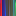

# arcLandscape/`algorithm.md`

# arcLandscape
Tool to convert text or hexadecimal sequence into generative art based on arc system.  
GitHub: https://github.com/YujiSODE/arcLandscape  
Wiki: https://github.com/YujiSODE/arcLandscape/wiki  
>Copyright (c) 2022 Yuji SODE \<yuji.sode@gmail.com\>  
>This software is released under the MIT License.  
>See LICENSE or http://opensource.org/licenses/mit-license.php  
______

`arcLandscape` is tool to convert text or hexadecimal sequence into generative art based on arc system.  
Arc system is a system, where every object is regarded as structure on a spherical surface.  
  
**Figure 1. Chart showing algorithm.**  
Result paths (blue) derives from given circle (dashed line) and value changes along _y_ axis (red).

# Value in a sequence
A hexadecimal sequence: `seq`.  
Length of this hexadecimal sequence: `L`.  
An index for a value in this hexadecimal sequence: `I := i%L`, where `i = 0,1,2, ...`.  

A value in this sequence `hex` is expressed as follows:  
`hex = seq[I] = seq[i%L]`

## Global constants
- `midX = (target canvas width)*0.5`
- `midY = (target canvas height)*0.5`
- `R0 = max(midX,midY)*SQRT(2)`
- `dT = π/100`

## Function: `arc(I)`
```
arc(I) := {
	x=xO+r0*cos(t);
	y=yO+r0*sin(t)+r;
	draw(t = from T0 to T0 +2*π);
}
```

### Local values in `arc(I)`
#### Color
Fill color: `#rrggbbaa = #{seq[I]}{seq[(I+1)%L]}{seq[(I+2)%L]}{seq[(I+3)%L]}{seq[(I+4)%L]}{seq[(I+5)%L]}ff`,  
where `(r,g,b,a) = 0,1, ...,e,f`.

#### Values

1. Direction and Radius for `O := (xO, yO)`
   - direction: `direction = π*seq[I]/8 = 2*π*hex/16`
   - radius: `R = R0*(1.0+seq[(I+1)%L]/16)`

2. `x` and `y`
   - `xO = midX +R*cos(direction)`
   - `yO = midY +R*sin(direction)`
   - `x = (target canvas width)*seq[(I+2)%L]/16`
   - `y = (target canvas height)*seq[(I+3)%L]/16`

3. Radius for `arc(I)` and `T0`
   - `T0`: initial angle between the positive x-axis and a vector `(x-xO, y-yO)`
   - radius: `r0 = SQRT((x-xO)^2+(y-yO)^2)`

### Changes of `r` in `arc(I)`
- ` r = 0.0`
- `T = dT`
- `t = T0 +T`
- `j = 1`
```
while(T<2*π){
	idx = I+seq[I]*j;

	a0 = seq[idx%L];
	a1 = seq[(idx+1)%L];
	a2 = seq[(idx+2)%L];
	a3 = seq[(idx+3)%L];

	r += (a1-a0)*(a3-a2);

	x=xO+r0*cos(t);
	y=yO+r0*sin(t)+r;

	j += 1;
	T = j*dT;
	t = T0+T;
}
```

## Normal order
```
i = 0;
while(i<L){
	arc(i);
	i+=1;
}
```

## Reverse order
i = from L-1 to 0
```
i = L-1;
while(!(i<0)){
	arc(i);
	i+=-1;
}
```
